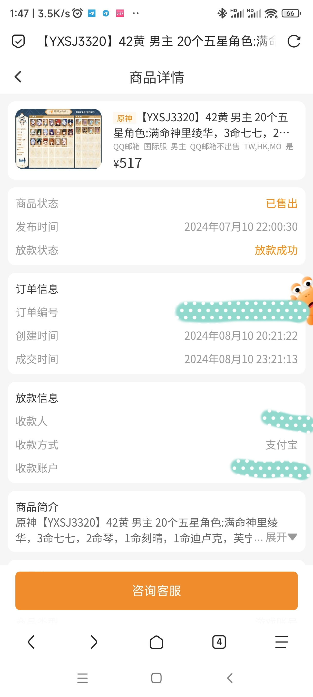

# 原神midi自动演奏器2

## 退游声明

本人于2024年8月10日已买掉账号，本项目宣布永久停更！

我为何退游？

- 天天暗示你上线刷掉树脂每日任务，否则浪费，一天不登录还不行。天天就是刷你那破圣遗物，刷半天就是一坨屎占满背包。刷半天一堆屎还不够，背包还故意的比武器的还少200格，你还要想办法清理😅
- 我玩的是国际服，就是为了能够少点国内各种对游戏的迫害。选了港澳台区，是为了少点延迟，你倒好，不在中国香港建服，玩半天抓出来的IP却是日本鬼子的🤡。文字狱系统还他妈完整的COPY到国际服。这还不够，6月上旬国服在搞“系统维护”的时候，你国际服居然也搞，我玩国际服意义何在🤬？
- 狗操的神里绫华，训你妈狗呢，在BV1ct4y1t7pv到处狗叫！



## v1老版本

https://github.com/weixiansen574/Genshin-Lyre-midi-player

## 更新、使用说明

可先去看看[v1版本的说明](https://github.com/weixiansen574/Genshin-Lyre-midi-player)，使用逻辑一致

**更新内容**

- 新版弃用无障碍改用shizuku service来进行点击，需要[安装shizuku](https://shizuku.rikka.app/zh-hans/download/)并授权才可使用。

- 保存到浮窗音乐列表，不再将处理（映射、移调）好的midi序列存入列表数据库，而是保存原始midi（私有目录路径）、音乐名、映射、移调信息到数据库，后面可修改参数再来演奏。若您调整配置，数据库中的配置不会被修改，需要你再次点击保存到浮窗播放列表，并且确认覆盖同名音乐的配置。
- 可自由选择某一排的映射，不再限制。
- 支持喇叭长按，选风物之诗琴即可，键位坐标一致，就是单纯少一排

## 我为什么要恢复更新

是的，这个软件使用率就是很低的，只是一个游戏的附加小玩具，项目就放那吃灰，最后签名秘钥还弄丢了，所以就停止了更新。

当然恢复更新的最大原因是发现在shizuku提供的adb用户下可以使用

``` java
Instrumentation.sendPointerSync(MotionEvent event);//效率低
InputManager.injectInputEvent(MotionEvent event);
```

这两种方法可以来实时操控屏幕，而不像无障碍服务需要预先画好路径再发给无障碍服务来执行滑动操作，导致滑动操作不能实时。
这为免root实现远程屏幕协助提供了支持。
此时原神突然更新了喇叭这一新乐器，原来的版本只能点击按键而不能按照midi音符的按下时间进行长按。
所以恢复此项目用于研究与练手，为将来IPv6远程协助项目做铺垫

当然因为之前高中时代留下来的屎山代码以及点击实现变换还有最重要的数据库结构大改的原因，2.x.x.x 新版将作为一个分支，新建一个包名，老版本演奏器可与此共存！

**当然，我就是为了做实验练手而非为了这个游戏。~~所以此项目仅为即兴作曲，请不要期待新版本~~**

**若您在意shizuku操控屏幕的实现，欢迎查看源码！**

## 限制

由于这种实时发送触控Event的方式容错率较低，所以要求midi不能太过于复杂，太复杂的midi在重复映射的多排会有被重复按下的一个按键的情况（如同你在一根手指按下钢琴键后，另一根手指给你按在按下钢琴的那根手指上）

## 彩蛋

自己找啊🙃